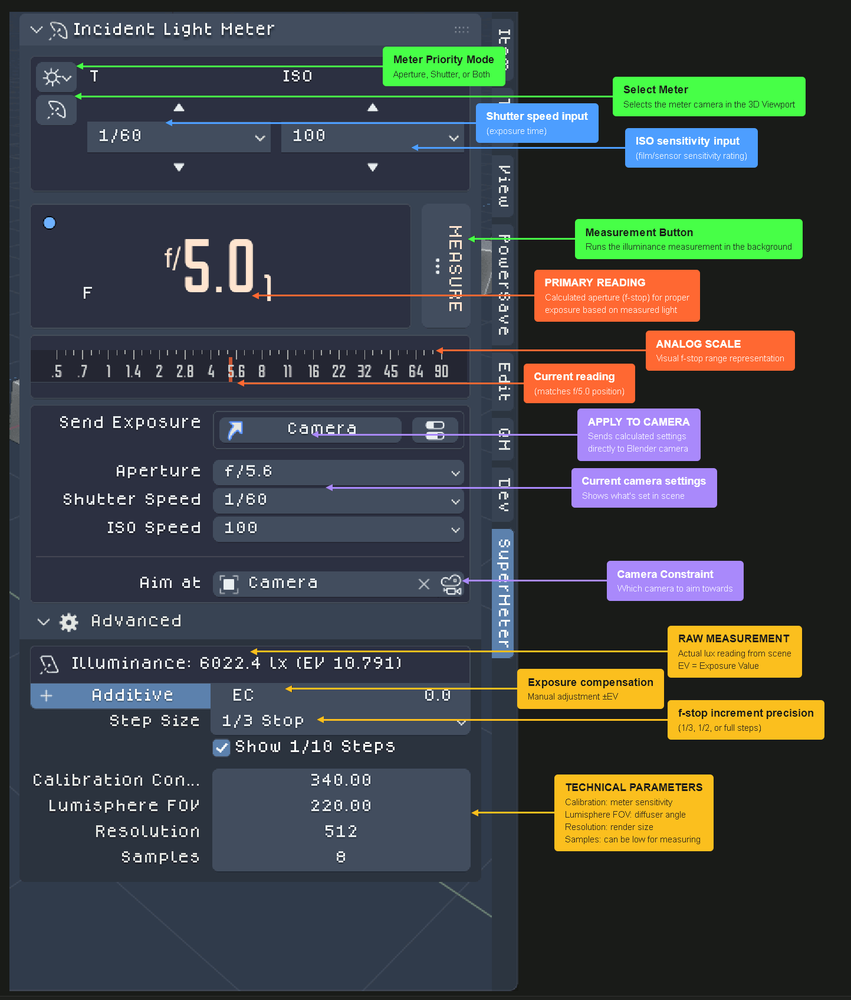

# Fotographie

*Fotographie* is a Blender extension that brings a modern incident light meter for the 3D Viewport. It behaves like a handheld meter: you capture the scene's illumination, review the Sekonic‑style readouts, then push the values straight into your active camera.

## Highlights
- **Viewport panel** – The *Fotographie* sidebar panel exposes T/F/TF modes, ISO presets, exposure compensation, camera targeting, and the background render controls.
- **Visual overlays** – Both an analog needle and a digital seven‑segment display stay onscreen while you work, making it easy to keep track of the measured exposure.
- **Background measurement** – Press *Measure* to spin up an isolated Cycles render of a panoramic meter camera that acts as the light meter. *Fotographie* computes the lux/EV and keeps a reference EXR you can inspect later.
- **Camera sync** – After a reading you can apply the measured value directly to the active scene camera (shutter, aperture, or ISO depending on the mode).

## Quick Start
1. In the 3D Viewport ensure the Sidebar is open (`N`), switch to the **SuperMeter** tab, and choose your metering mode (T/F/TF).
2. Press *Create Light Meter* to spawn the light meter and camera tracker.
3. Hit **Measure**. *Fotographie* copies the current `.blend`, renders in the background, and streams the results back into the panel/overlays.
4. Optional: click **Apply Meter To Camera** to push the measured exposure into the active camera.

## Background Job Notes
- The background render temporarily copies your `.blend` so it never touches the working file.
- Background measurement runs a separate Blender instance in the background, copies the current `.blend` to a temp location, and renders from the panoramic meter camera so your working file never changes. The turnaround time is mostly determined by your GPU (or CPU) and the sample count you pick.

## License / Credits
- Licensed under **GPL‑3.0-or-later**. See `blender_manifest.toml`.
- Includes the **Nike 2002‑04** pixel font by [Daniel Gellatley](https://www.instagram.com/gellatley/) (used for the on‑screen readout).
